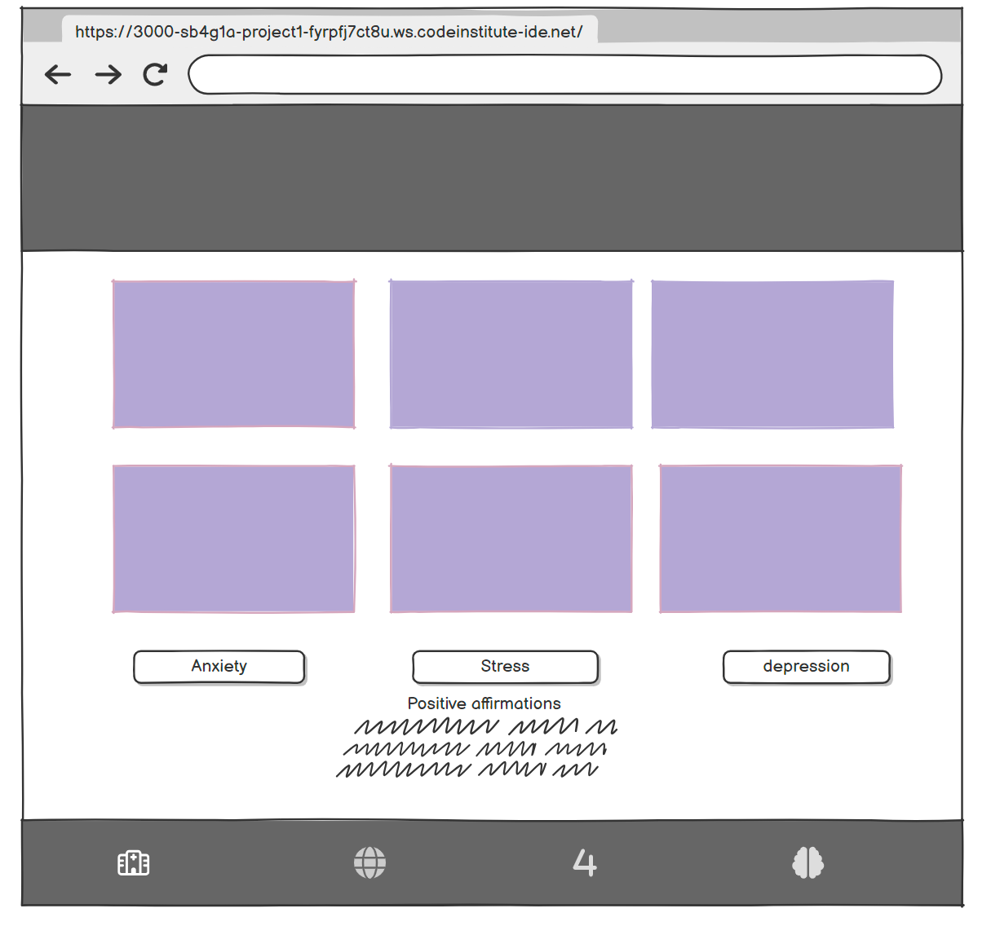

### Mental Health Matters

-Mental Health Matters is a mental health page dedicated to educate in simpler terms the impact of menatl health. Mental Health page created by someone who has had past battles with mental health. The page is designed to help and inform in the easiest way possible. the website is purposly designed to inform thus the lack of navigation bar at the top of the page. The website goes into detail about other mental health issues as well, such as, anxiety, stress, and depression.

Here is my deployable example :https://s-b4g1a.github.io/project-1/

# User experience

- This website was thought of to be colourful and vissualy appealing, with the colours following the theme of mental health, as the colour scheme that has been used was heavily infulenced by colours associated with mental health.

- Navigating throught the website is user friendly as the website changes for the user device with the card icons remaining big on smaller devices to enable the user to see the information that is being presented.

- I decide to stick to 3 main colours as my reasearch has shown that these are the colours that closley represent menatl health, and still keep the website enganging to read. Those colours are :
-#5f5b6b
-#fcf5e5
-#e4c1f9

-I used https://coolors.co/visualizer/e4c1f9-fcf5e5-f08a4b-d78a76-5f5b6b to vizulise my web page.

#Typography and icons

-I used FontAwsome icons which can be loctaed at the bottom of my page, these icons are directly linked to the website's I used to help me collate my websites information.  

[FontAwsome](http://fontawesome.com/ "FontAwsome")

#Wireframes

-In order to create the best wireframe possible I used the software [Balsamiq](http://https://balsamiq.cloud/sjo098x/ptxdd6s/r2278 "Balsamiq") 

#Home page

#Mobile view

#features

- All my pages follow the same layout as they are easy to navigate through and i wanted to keep a constant color palette and theme.
- The buttons located at the bottom of the page are used to navigate between the pages, as the page changes the button at the bottom change so you are easily able to go back to the home page. The navigation elements have been purposly been put at the bottom of the page so that the user digests the content, this is important as all the pages content link to each other.
- Within the footer element you are able to find the exact sources used that have been used within the page. These links are styled through icons found on FontAwsome. 

##Future features

-Originally I would have liked for my cards on my pages to have been in a carosel allowing the reader to flick through the different cards, which would have enabled me to have all my information on one page rather than have four seperate pages.
-Another feature I would have liked to implement would have been to have included a page dedicated to positive quotes to imrove mental health.

#Tools and Technologies

-Through-out this project the tools that I constantly used were [Gitpod](http://https://www.gitpod.io/ "Gitpod") which was where I coded my project, I also used [Bootstrap](http://https://getbootstrap.com/docs/4.6/getting-started/introduction/ "Bootstrap") to help me create various components easier. I used  git as a version contral tool.

#Deployment
-This site was deployed through the GitHub Pages. The steps are as followed: 
- Within the GitHub Repository navigate to the settings tab
-One the settings tab locate the pages section
-find the deploy link and follow the provided steps on the site.

#Credits

###Content
-The table below holds the links and the names to the websites I used to assist me with this project.

| Source  | Location  | Notes  |
| ------------ | ------------ | ------------ |
|https://getbootstrap.com/docs/4.3/getting-started/introduction/   |  Entire site | Website used to generate useful components  |
|https://copilot.microsoft.com/   | Entire site  |  AI tool I used generate code layout, used to visulize what the output would look like |
| https://www.w3schools.com/  | Entire site  |  Used when I wanted an element but didn't understand to get it to work |

###Media
| Source  | Location  |Notes   |
| ------------ | ------------ | ------------ |
| https://www.who.int/news-room/fact-sheets/detail/mental-health-strengthening-our-response  | Entire site  | General information that I used  |
| https://www.nhs.uk/every-mind-matters/mental-wellbeing-tips/top-tips-to-improve-your-mental-wellbeing/   |  Entire site | General information that I used  |
|https://www.mqmentalhealth.org/conditions/anxiety-disorder/?gad_source=1&gclid=Cj0KCQjw99e4BhDiARIsAISE7P-nfa3wHScYNOc52zQ9O_5mUcs-GqzXIEj-cW3y2DDqQ0E1VC3KBbIaAv7TEALw_wcB    | Entire site  | General information that I used  |
|https://www.priorygroup.com/blog/positive-affirmations-for-mental-health   |Entire site   | General information that I used  |

###Acknowledgement
-First off all I would like to thank my facilitator Shelly Maughan. Since the start of my Project she has helped me stay calm and keep me on track.
-I would also like to thank my friend Aaron Singh who helped me at points within my project jouney when I needed assistance.

**Table of Contents**

[TOCM]

[TOC]

###End
